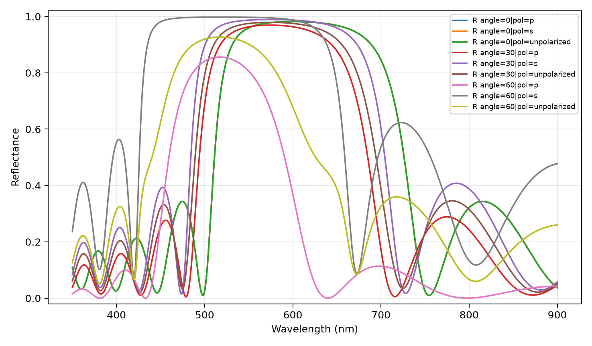
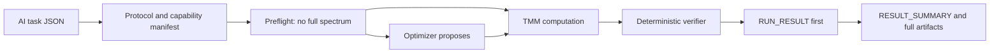

<div align="center">

# VeriTMM

### An AI-ready transfer-matrix tool for autonomous multilayer-optics research

[](https://github.com/Lihonggang-scnu/VeriTMM/actions/workflows/ci.yml)
[](https://www.python.org/)
[](LICENSE)
[](THIRD_PARTY_NOTICES.md)

**[中文说明](README.zh-CN.md) · [Architecture](docs/ARCHITECTURE.md) · [Research API](docs/RESEARCH_INTERFACE.md) · [Validation](docs/VALIDATION.md) · [AgentBench](docs/AGENTBENCH.md) · [Examples](examples)**

</div>

VeriTMM is first and foremost a **transfer-matrix-method (TMM) tool** for
planar, isotropic, one-dimensional multilayer optics. Its distinctive purpose
is to make established TMM physics safer and easier for AI agents to use in
autonomous scientific work. Stable forward simulation, mixed-coherence
physics, governed material data, differentiable inverse design, convergence
checks, independent cross-validation, and machine-readable physics certificates
are exposed through one reproducible task protocol.

VeriTMM v1.0 builds a deterministic, AI-facing laboratory around
that TMM core: capability discovery, JSON Schema contracts, no-spectrum
preflight, typed failures, auditable run artifacts, persistent experiments,
parameter studies, sensitivity/tolerance analysis, robust thickness design,
and an offline AgentBench. This remains a TMM execution and verification tool,
not a generic scientific-research workflow, an external-solver orchestrator,
or an LLM kernel.

The central idea is simple: **AI proposes, TMM computes, and deterministic
verification certifies**. Neither an AI agent nor an optimizer may certify its
own proposal. Every result—forward or optimized—passes through the same physics
checks before it is accepted.



## Why this project exists

> For the conceptual background behind this project, see [Instrument-Centered AI for Science](README_Instrument-Centered_AI4S.md).

Most TMM libraries assume that a human expert will choose valid inputs, inspect
warnings, and interpret the result. An autonomous AI agent needs a stricter
interface. It must be able to ask: Which material dataset was used? Was it
extrapolated? Did the spectrum converge? Does a second implementation agree?
Is the requested problem inside scalar TMM's validity domain? Can the result be
replayed without relying on conversational memory?

VeriTMM makes those questions part of the executable contract rather than
leaving them to implicit human judgment. The numerical core remains TMM; the
additional engineering makes that core machine-operable, auditable, and harder
for an AI system to misuse.

## Highlights

| Capability | What is implemented |
|---|---|
| Stable forward physics | Coherent S-matrix solver, characteristic-matrix diagnostic path, and Byrnes reference backend |
| Broad multilayer tasks | Thin films, DBRs, 1D photonic crystals, defect cavities, chirped stacks, absorbers and finite substrates |
| Illumination | Multi-wavelength, multi-angle, s/TE, p/TM and unpolarized calculations |
| Mixed coherence | Coherent films combined with optically thick/incoherent layers |
| Observables | R/T/A, complex amplitudes, fields, layer absorption, ellipsometry, system emissivity, phase and dispersion |
| Material governance | Explicit dataset identity, range checks, provenance and fail-closed extrapolation policy |
| Optical database | Bundled refractiveindex.info snapshot: 2,712 pages, 252,442 n points and 209,839 k points |
| Inverse design | Batched PyTorch S-matrix, multiband thickness optimization, fabrication bounds, multistart and quantization |
| Scientific verification | Capability gate, energy/passivity checks, spectral refinement and independent-solver comparison |
| AI-facing protocol | Capability discovery, five task schemas, deterministic preflight, typed failures and JSON run envelopes |
| Reproducible studies | `ExperimentStore`, content-aware cache, lineage, compare, finite sweeps and resume |
| Research interface | Deterministic design spaces, verified evaluator/batches, dataset generation, ask/tell adapter and fixed-layer environment |
| Scientific analysis | Audited thickness sensitivity, seeded tolerance/yield analysis and Wilson intervals |
| Robust inverse design | Stochastic training objectives followed by independent Monte Carlo evaluation and role-based candidates |
| Agent evaluation | 80+ deterministic cases, unsupported-task false-acceptance accounting and framework-neutral A/B trajectories |
| Reproducibility | Immutable JSON tasks, normalized identities, `RUN_RESULT.json`, compact summaries, full artifacts and certificates |

## What we contribute

The transfer-matrix method is established physics. VeriTMM's contribution
is not a new TMM equation, nor a generic scientific-research workflow. It is an
**AI-ready TMM tool interface** that integrates the following components:

1. A machine-readable, immutable task language shared by forward simulation
   and inverse design, so an AI agent can submit a complete task without hidden
   conversational assumptions.
2. Explicit capability boundaries that reject gratings, metasurfaces,
   anisotropy, nonlinear optics and other unsupported physics with typed,
   machine-readable reasons.
3. Material selection as a reproducible scientific decision: provider, dataset
   ID, wavelength coverage, interpolation policy and source metadata travel with
   the result.
4. Independent recomputation of AI- or optimizer-proposed designs before
   acceptance.
5. A physics certificate that lets an AI system inspect convergence,
   cross-solver agreement, energy balance, limitations and input identity
   through structured fields rather than prose.
6. A deliberate separation between target score and physical validity: an
   ambitious target may be missed without turning a correct calculation into a
   false failure—or a high score into false proof.

The command surface makes this contract usable without conversational state.
The engine has no dependency on a particular language model, agent framework,
external solver, or LLM runtime. Any AI system that can produce the JSON task
contract and read the structured outputs can use it as a deterministic optical-
physics tool.

## AI-facing contract

| AI action | VeriTMM responsibility |
|---|---|
| Propose a stack, material choice, target or thickness update | Validate and normalize the task before calculation |
| Request forward simulation or differentiable optimization | Execute the appropriate TMM path within declared capability limits |
| Iterate after observing a result | Preserve reproducible inputs, outputs and failure reasons |
| Select a promising candidate | Recompute it independently and issue a physics acceptance certificate |
| Ask for unsupported physics | Reject it explicitly instead of returning a plausible-looking spectrum |

This division is intentional: AI supplies scientific strategy and candidate
designs; VeriTMM supplies deterministic TMM computation, bounded execution and
physical verification.

## v1.0 command-line protocol

The installed `veritmm` command is the public machine-facing entry point:

```bash
veritmm describe --json
veritmm schema simulation
veritmm schema optimization
veritmm schema sweep
veritmm schema sensitivity
veritmm schema tolerance
veritmm preflight task.json --json
veritmm run task.json --output-dir outputs/tmm_run --json
veritmm history --json
veritmm inspect RUN_ID --json
veritmm lineage RUN_ID --json
veritmm compare RUN_A RUN_B --json
veritmm benchmark --offline --json
```

`describe` returns the current capability manifest. The `schema` commands
export JSON Schema contracts. `preflight` checks the task contract, TMM
capability boundary, material coverage on the complete declared wavelength
grid, backend routing, and numerical
risk notices; it does **not** run a complete spectrum or an optimization. `run`
performs the preflight, computes with TMM, and sends the result through the
deterministic verifier.

`RUN_RESULT.json` is the first-read envelope for a run, including status,
failures, certificate identity, artifact references, and next machine actions.
Read `RESULT_SUMMARY.json` next for compact spectral and physics features; it
keeps an agent from having to ingest the full `SIMULATION_RESULT.json` or
`SPECTRA.csv` before deciding what to do. Full artifacts remain available when
the scientific question requires them.

### Context-efficient response profiles

Machine-facing CLI and Python responses use `compact` by default. The same
unified `RUN_RESULT.json` entry supports richer additive projections:

```bash
veritmm run task.json --output-dir outputs/tmm_run --json --detail compact
veritmm run task.json --output-dir outputs/tmm_run --json --detail standard
veritmm run task.json --output-dir outputs/tmm_run --json --detail full
```

`compact` targets 16 KiB and has a fixed 32 KiB hard limit. It keeps
decision-critical status, certificate identity, bounded metrics, typed actions,
and valid relative artifact references. `standard` exposes bounded diagnostics;
`full` keeps richer scalar/mapping metadata and context. Full means the full
view of retained, bounded response metadata; it is not a raw-data promise:
spectra, wavelength grids, R/T/A channel arrays, tolerance samples,
optimizer histories, sweep children, benchmark cases/trajectories, and full
provenance stay external to every response profile. Run responses expose them
through hashed artifact references; a response without reachable references
reports `artifact_backed: false`. The profile is recorded under
`summary.response` as `veritmm-response-v1`. Each run also persists bounded,
unprojected `RESPONSE_CONTEXT.json` (`veritmm-response-context-v2`) with
explicit retention limits plus omission/truncation accounting, so
`inspect --detail standard|full` reconstructs richer profiles from the source
instead of re-projecting compact `RUN_RESULT.json`. `inspect` projects and
guards its complete v2 document—including the experiment record—under one
outer response profile. Legacy runs without a validated response context fail
closed with `response_detail_unavailable` for standard/full. The existing
`veritmm-run-result-v1` envelope and task schemas remain compatible.

## Research interface

The independent `tmm_engine.research` package defines deterministic design
spaces over the existing `SimulationTask`, weighted R/T/A objectives and
constraints, managed certificate-bound evaluation, resumable batches, and a
verified `DatasetFactory`. Sampling supports random, finite grid, Latin
hypercube, and a dependency-free Sobol core for at most 16 dimensions.

`RandomSearchAdapter` is the reference algorithm-neutral ask/tell adapter.
`VerifiedTorchDataset` imports Torch only when constructed, uses normalized
designs plus explicit objective targets, and excludes every unverified row.
`DesignSpaceEnvironment` needs no Gymnasium; it assigns fixed-layer variables
and routes `stop` through `ResearchEvaluator`. Layer addition/removal is
reserved and returns typed unsupported status.

Algorithms, datasets, ML adapters, and rewards only consume evaluation
evidence. They cannot create or upgrade a physics certificate. See the
[research interface](docs/RESEARCH_INTERFACE.md),
[DatasetFactory guide](docs/DATASET_FACTORY.md), and
[runnable example](examples/research_interface.py).

## Reproducible studies and robustness

The same `run` entry point accepts sweep, sensitivity, and tolerance contracts.
Examples are bundled under `examples/tmm_tasks/`. A sweep creates a parent run,
stable child tasks, per-child artifacts, and a checkpoint that can be resumed.
Sensitivity uses the differentiable backend but audits each derivative with an
independent NumPy central difference. Tolerance v2 reports conditional yield over
completed samples separately from overall success over requested samples, with a
typed computational-failure taxonomy. Robust optimization uses one declared
uncertainty/boundary policy in training and final evaluation, but stochastic
training only proposes designs; final roles come from a fresh independent Monte
Carlo evaluation. An incomplete final ensemble can never win `best_robust`.

The local `ExperimentStore` is append-only by `run_id`. Existing canonical run
artifacts are never merged or overwritten, and cache replay creates a fresh run
identity. Cached sweeps also create fresh identities for every copied child while
retaining explicit links to the source parent and source child runs.

If independent final robustness evaluation fails, the nominal portfolio remains
inspectable but `best_robust`, `best_quantized`, and the compatibility alias
`most_robust` remain null. A heuristic screening score is never promoted to a
formal robust result.

These are different claims. `PHYSICS_ACCEPTANCE_CERTIFICATE.json` answers
whether the nominal TMM result passed its physical/numerical checks.
`SENSITIVITY_RESULT.json`, `TOLERANCE_RESULT.json`, and
`ROBUSTNESS_REPORT.json` answer separate questions about perturbations.

## Offline AgentBench

```bash
veritmm benchmark --offline --json
```

AgentBench uses no LLM and no network. It validates case contracts, preflight
decisions, typed failures, run artifacts, physics assertions, and repeatability.
Out-of-scope tasks are measured explicitly and the release gate requires an
unsupported false-acceptance rate of exactly zero. The generic A/B harness in
`tmm_engine.agent_harness` accepts any external callable or pre-recorded
trajectory; VeriTMM core imports no proprietary agent SDK. Benchmark evidence
never changes a capability rule or physics certificate.

## Installation

For the published release:

```bash
pip install veritmm  # installs the current 1.0.0 release
```

For development from a checkout:

```bash
git clone https://github.com/Lihonggang-scnu/VeriTMM.git
cd VeriTMM
python -m pip install -e .
```

For differentiable optimization and plots:

```bash
python -m pip install -e ".[optimize,plot]"
```

## Quick start

### Agent-facing JSON task

Use the command-line protocol for a deterministic machine handoff:

```bash
veritmm preflight examples/tmm_tasks/periodic_dbr_simulation.json --json
veritmm run examples/tmm_tasks/periodic_dbr_simulation.json \
  --output-dir outputs/dbr --json --detail compact
```

The run writes `RUN_RESULT.json` and, depending on mode and settings,
`RESULT_SUMMARY.json`, `PREFLIGHT_REPORT.json`, `NORMALIZED_TASK.json`,
`PHYSICS_ACCEPTANCE_CERTIFICATE.json`, `SIMULATION_RESULT.json`, and
`SPECTRA.csv`. Optimization also writes `OPTIMIZATION_RESULT.json` and
`INDEPENDENT_VALIDATION.json`, `DESIGN_PORTFOLIO.json`, and independently
certified candidate artifacts; a plot is optional. A failed preflight still
produces a machine-readable run envelope and typed failure actions.

### Python API

```python
from tmm_engine import (
    IlluminationSpec, LayerSpec, MaterialRegistry, MediumSpec, SimulationTask,
    SpectralGrid, StackSpec, TMMWorkbench,
)

task = SimulationTask(
    stack=StackSpec(
        incident=MediumSpec.air(),
        layers=(
            LayerSpec(material="tio2", thickness_nm=90),
            LayerSpec(material="sio2", thickness_nm=140),
        ) * 6,
        exit=MediumSpec(material="sio2"),
        name="visible_dbr",
    ),
    spectrum=SpectralGrid(start_nm=400, stop_nm=800, points=401),
    illumination=IlluminationSpec(
        angles_deg=(0.0, 30.0),
        polarizations=("s", "p"),
    ),
)

result = TMMWorkbench(MaterialRegistry()).simulate(task)
print(result.audit)
```

### Direct reproducible task runner

```bash
python scripts/run_tmm_task.py \
  --input examples/tmm_tasks/periodic_dbr_simulation.json \
  --output-dir outputs/dbr
```

The legacy script spelling is a compatibility wrapper around the same
execution service. It writes:

- `NORMALIZED_TASK.json`
- `SIMULATION_RESULT.json`
- `SPECTRA.csv` and, when Matplotlib is installed, `SPECTRA.png`
- `PHYSICS_ACCEPTANCE_CERTIFICATE.json`
- `RUN_MANIFEST.json`
- `RUN_RESULT.json` and `RESULT_SUMMARY.json`

For AI callers, prefer the `veritmm run ... --json --detail compact` interface
above so `RUN_RESULT.json` is the first entry point and the full spectrum is
opened only through its artifact reference. Use `--detail standard|full` when
an inline diagnostic read is explicitly needed.

### Search the bundled material catalog

```bash
python scripts/search_optical_material.py TiO2 \
  --provider rii --start-nm 500 --stop-nm 800 --limit 5
```

Select a `dataset_id` explicitly when reproducing research results. The registry
does not silently extrapolate optical constants beyond their measured range.

### Differentiable inverse design

```bash
python scripts/run_tmm_task.py \
  --input examples/tmm_tasks/antireflection_optimization.json \
  --output-dir outputs/antireflection
```

The PyTorch optimizer proposes thicknesses; the NumPy/reference workbench then
recomputes the design, validates target evaluation, and issues the certificate.
The run also preserves several physically admitted candidates under separate
performance, robustness, manufacturability, and structural-distinctiveness
roles instead of pretending one scalar score is the only useful answer.
In short: **AI proposes, TMM computes, and the verifier certifies**. An
optimizer cannot certify its own proposal.

## Verification model



The raw numerical output is never clipped to hide a physical violation.
Unsupported tasks and out-of-range data fail with explicit diagnostics. See
[the validation guide](docs/VALIDATION.md) for the current acceptance layers.

## Tested scientific scope

- coherent and mixed-coherence planar stacks;
- periodic and chirped multilayers, DBRs and defect cavities;
- lossy absorbers and finite thick substrates;
- angular and polarization response;
- layer-resolved absorption, ellipsometry and field profiles;
- phase, group delay, group-delay dispersion and Bloch-band diagnostics;
- differentiable and robust multiband thickness optimization;
- finite parameter sweeps with resume, sensitivity audits, and tolerance/yield studies.

The regression suite also reproduces the stop-band, defect-mode and field-
enhancement trends of a published multilayer cavity example. This is a
trend-level software validation, not a claim of exact fabrication replication.

## Deliberate boundaries

This is a scalar, isotropic, planar 1D solver. It does **not** claim to model
lateral gratings, metasurface unit cells, diffraction orders, anisotropic
tensor layers, nonlinear optics, diffuse scattering, finite beams, 3D near
fields, thermal transport or fabrication chemistry. Use RCWA, Berreman 4×4,
FDTD or FEM when those effects are essential.

VeriTMM does not execute external solver families or contain an LLM kernel.
The optional MCP transport remains deferred: the Python and CLI protocol are
complete without it. Those boundaries do not change the TMM scope of the
numerical engine.

## Testing

```bash
python -m pip install -e ".[test]"
python -m pytest -q
```

PyTorch-specific tests are automatically skipped when the optional optimizer
dependency is absent.

## Data, citation and license

Project code is Apache-2.0-licensed. The bundled refractiveindex.info data are CC0;
the runtime Byrnes `tmm` dependency is MIT-licensed. See
[THIRD_PARTY_NOTICES.md](THIRD_PARTY_NOTICES.md) for attribution and citation
requirements. When publishing scientific results, cite the original optical-
constant datasets selected by your run—not only this software.

## Development note

Parts of this codebase were written with AI-assisted code generation. Every
physics claim, acceptance rule, and numerical tolerance in the verifier is
covered by the test suite and CI gates described above; the certificate
boundary does not depend on how the code was authored. Reviewers are
encouraged to treat the tests and certificates as the contract.

## Status

`v1.0.0` is the first stable release. It delivers algorithm-neutral,
certificate-bound research infrastructure on top of a verifier-first TMM core.
Public APIs and protocol details are stable; the physics boundary remains
fail-closed.
