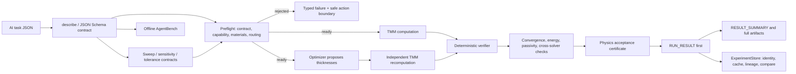
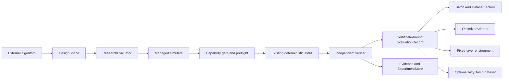

# Architecture

VeriTMM remains a TMM engine. Version 1.1 exposes a deterministic protocol,
reproducible experiment layer, scientific-analysis studies, a research
interface, and an offline agent benchmark around that engine. It does not turn
the project into a generic scientific-research workflow, an external-solver
orchestrator, or an LLM runtime.

The roles are deliberately separate: **AI proposes, TMM computes, and the
verifier certifies**. The optimizer is a proposal mechanism, not an authority;
every optimized stack returns to independent recomputation and the same
acceptance path used by a forward simulation.

## Research layer

The v1.1 research package is a client of the managed execution boundary, not a
numerical backend:

`DesignSpace` always reconstructs the existing `SimulationTask`. Fixed layers
are retained, candidate IDs are content-derived, and normalized variables do
not define new physics. `ResearchEvaluator` calls managed `simulate`; it does
not call a workbench, solver, or certifier directly. Dataset rows, optimizer
observations, Torch targets, and environment rewards can retain certificate
identity but cannot create acceptance.

Batch and dataset first reads remain compact and bounded. Their ledgers point
to ordinary run artifacts for spectra and detailed evidence. Random, grid,
Latin-hypercube, and 16-dimensional core Sobol sampling are deterministic by
contract/plan/seed/index. Variable layer count and concrete ML/RL algorithms
are reserved.

## Protocol boundary

- `veritmm describe --json` returns the machine-readable capability manifest.
- `veritmm schema simulation|optimization|sweep|sensitivity|tolerance` exports
  the public task contracts.
- `veritmm preflight task.json --json` validates the task, capability boundary,
  material coverage on the complete declared wavelength grid, backend routing, and
  numerical risk notices. It does not run a complete spectrum or optimization.
- `veritmm run task.json --output-dir ... --json` performs preflight, invokes
  the existing TMM/optimization paths, and writes the machine-facing envelope.

`RUN_RESULT.json` is the first-read artifact. It references the other files and
contains status, typed failures, certificate identity, and next machine actions.
`RESULT_SUMMARY.json` is intentionally compact so an agent can inspect physics
and spectral features without first ingesting the full spectrum. The full
`SIMULATION_RESULT.json` and `SPECTRA.csv` remain available for scientific
inspection. A bounded, unprojected `RESPONSE_CONTEXT.json` v2 preserves the
retained non-array response source used by `inspect --detail standard|full`
and records retention limits plus omitted/truncated paths. It is written before
artifact indexing so its own hash is never self-referential. Loaders validate
its schema, run/task binding, no-self-reference rule, and the enclosing
artifact reference hash/size before reconstruction.

`ExperimentStore` adds invocation identity, content-aware cache provenance,
parent/child lineage, history, and deterministic comparisons without putting
research metadata into a physics certificate. Sweep, sensitivity, tolerance,
and robust-optimization artifacts are separate scientific claims: a valid
physics certificate does not imply high manufacturing yield, and a high yield
does not replace physical verification.

## Numerical backends

- **S-matrix:** default coherent solver, selected for numerical stability.
- **Characteristic matrix:** diagnostic backend for comparison and debugging.
- **Byrnes reference:** independent implementation for coherent cross-checks,
  mixed-coherence propagation, ellipsometry, fields, and layer absorption.
- **PyTorch differentiable S-matrix:** batched gradient path for thickness design;
  its output is independently recomputed before acceptance.

## Physics backend layer (`tmm_engine.backends`)

The physics of one coherent stack assembly is described by a `KernelSpec` — a
plain data container (complex index per medium ordered incident → films →
exit, film thicknesses, wavelengths, angle, polarization, assembly formula
name) that imports neither numpy nor torch, so every backend consumes the same
description natively and torch tensors keep their autograd graph.  Backends
implement one minimal surface, `assemble(KernelSpec) -> BackendResult` (R/T/A
plus optional r/t amplitudes):

- `numpy_backend` — the reference: a thin wrapper over the existing
  `tmm_engine.tmm_solver` S-matrix path with unchanged numerics.
- `torch_backend` — wraps `tmm_engine.differentiable.DifferentiableTMM`
  (batched, autograd-capable, float64 by default with an opt-in float32
  tier).  Explicit dtypes on sequence inputs keep the phase thickness free of
  float32 quantization; tensor inputs pass through untouched.
- `jax` — reserved name, deliberately unimplemented.

The registry discovers sibling `*_backend.py` modules that declare
`BACKEND_NAME`, so **adding a backend means adding one file** — no existing
code changes.  A backend that is absent or not importable (for example torch
without the optional extra, or the unimplemented jax) is reported as
`BackendNotRegisteredError` by `get_backend`, never as a raw `ImportError`.
Cross-backend equivalence (R/T agreement to 1e-9 relative in float64,
gradient-vs-central-difference to 1e-6, and the drop-in discovery contract)
is pinned by `tests/test_backend_equivalence.py`.  The Byrnes implementation
stays outside this layer on purpose: it remains an independent
cross-implementation check, not a registered execution backend.

**New backend guide:** create `tmm_engine/backends/<name>_backend.py`, set
`BACKEND_NAME = "<name>"`, implement `assemble(kernel: KernelSpec) ->
BackendResult` (accept unbatched kernels; promote to a batch of one), and
import your array library inside the file.  The registry picks the file up
automatically on the next lookup; nothing else changes.

The v1.1 protocol formally exposes finite sweep, thickness sensitivity, and
tolerance/yield operations. It still does not execute external solver families.
Unsupported geometry, material, excitation, or output combinations are
rejected with typed failures rather than routed silently. AgentBench observes
that behavior but has no authority to change it. The optional MCP layer is
deferred because the CLI and Python protocol are already complete transports.
