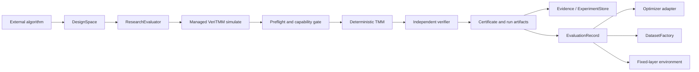

# Research interface (v0.6)

VeriTMM v0.6 adds an independent Python research layer for proposing,
evaluating, and persisting fixed-layer optical designs. It does not add a
solver or another path to physical acceptance.



Algorithms propose candidates. Only the managed simulation path and an
accepted independent `PHYSICS_ACCEPTANCE_CERTIFICATE.json` establish
`physics_accepted=True`. Objective scores, feasibility, ML targets, and
environment rewards never certify physics.

## Public surface

- `DesignSpaceContract`, `DesignCandidate`, and `DesignSpace` define stable,
  content-derived candidate identities over an existing `SimulationTask`.
- `ContinuousThicknessVariable`, `DiscreteThicknessVariable`, and
  `MaterialChoiceVariable` vary declared properties. Other layers stay fixed.
- `ObjectiveSet` combines weighted maximize, minimize, or target objectives and
  threshold constraints over bounded R/T/A wavelength bands.
- `ResearchEvaluator` converts a candidate back to `SimulationTask` and calls
  managed `simulate`; it never calls a solver or certifier directly.
- `BatchEvaluationRequest` and `BatchExecutor` provide replaceable, resumable
  batch orchestration. `SequentialBatchExecutor` is the reference executor.
- `DatasetFactory` samples through a `SamplingPlan`, evaluates through the
  public batch path, and writes verified compact rows.
- `OptimizerAdapter` is the algorithm-neutral ask/tell protocol.
  `RandomSearchAdapter` is the only reference optimizer in v0.6.
- `VerifiedTorchDataset` is a lazy optional adapter over accepted dataset rows
  and explicit objective targets. It never reads spectra.
- `DesignSpaceEnvironment` has no Gymnasium dependency. It assigns fixed-layer
  variables and evaluates only on `stop` through `ResearchEvaluator`.

All Pydantic contracts are strict, immutable, versioned, and deterministically
JSON serializable. Use `veritmm describe --json` to discover the bounded
`research_interface` capability manifest.

## Minimal runnable example

Run the complete example from the repository root:

```bash
python examples/research_interface.py --output-root outputs/research-demo
```

The script defines one continuous thickness variable, a mean-reflectance
objective, a two-point Sobol plan, and a `DatasetFactory`. Its stdout is one
compact JSON result. Full spectra remain in per-evaluation run artifacts.

The essential construction is:

```python
space = DesignSpace(DesignSpaceContract(base_task=task, variables=variables))
objectives = ObjectiveSet(objectives=objective_specs)
evaluator = ResearchEvaluator(space, objectives, evaluator_config)
result = DatasetFactory(space, evaluator).generate(plan, dataset_config)
```

An optimizer uses the same evaluator:

```python
optimizer = RandomSearchAdapter(space, seed=7)
candidates = optimizer.ask(4)
request = BatchEvaluationRequest(
    design_space_id=space.design_space_id,
    objective_set_id=objectives.objective_set_id,
    candidates=candidates,
)
batch = evaluator.evaluate_many(request)
# Load the certificate-bound EvaluationRecords from batch.artifact_root/BATCH_INDEX.jsonl.
optimizer.tell(records)
best = optimizer.best()
```

`best` is `None` until at least one completed, accepted, certificate-bearing
record has been told.

## Determinism and state

Candidate IDs derive from canonical design-space identity plus normalized
variable assignment, never call order. Random, Latin-hypercube, and Sobol
plans bind every point to the plan seed and sample index. Grid order is the
declared-variable Cartesian order. The dependency-free core Sobol engine is
32-bit and supports at most 16 variables; it fails rather than substituting a
random sampler.

`RandomSearchAdapter.state_dict()` stores a bounded versioned cursor, pending
candidates, compact observations, and best identity. Loading validates the
design-space identity, seed, candidate provenance, and ranking. Unknown,
duplicate, or twice-told candidates are rejected.

## Environment and optional Torch adapter

`choose_material` and `choose_thickness` assign declared variables. `stop`
evaluates a complete candidate and returns reward plus the original status,
run, task, and certificate identities. `add_layer` and `remove_layer` return a
typed unsupported result because variable layer count is reserved.

Importing `tmm_engine.research` imports neither Torch nor Gymnasium. Constructing
`VerifiedTorchDataset` imports Torch lazily and raises an actionable optional-
dependency error when it is unavailable. Features are `normalized_design`;
targets must be explicit objective values or scores supplied by the caller.

## Deliberate limits

v0.6 provides research infrastructure, not a concrete third-party optimizer,
neural network, RL algorithm, PINN, diffusion model, MCP transport, variable-
layer generator, or new numerical solver. Unsupported physics remains rejected
by the existing capability gate.
